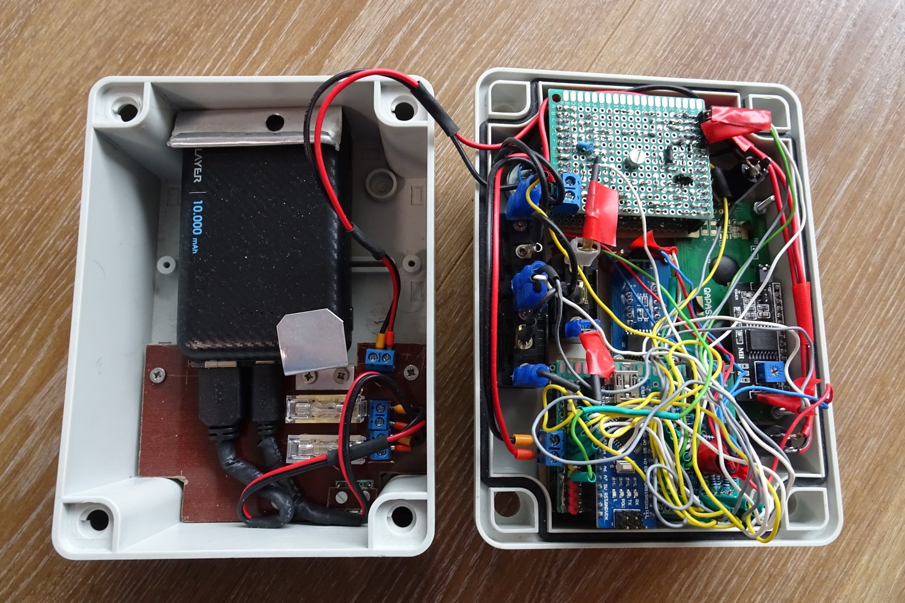
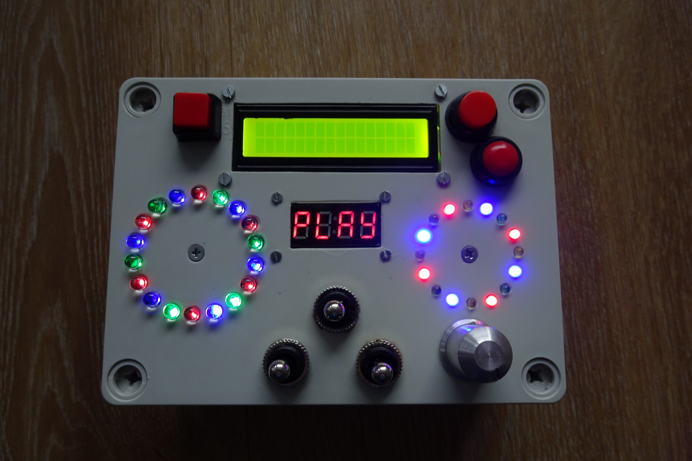
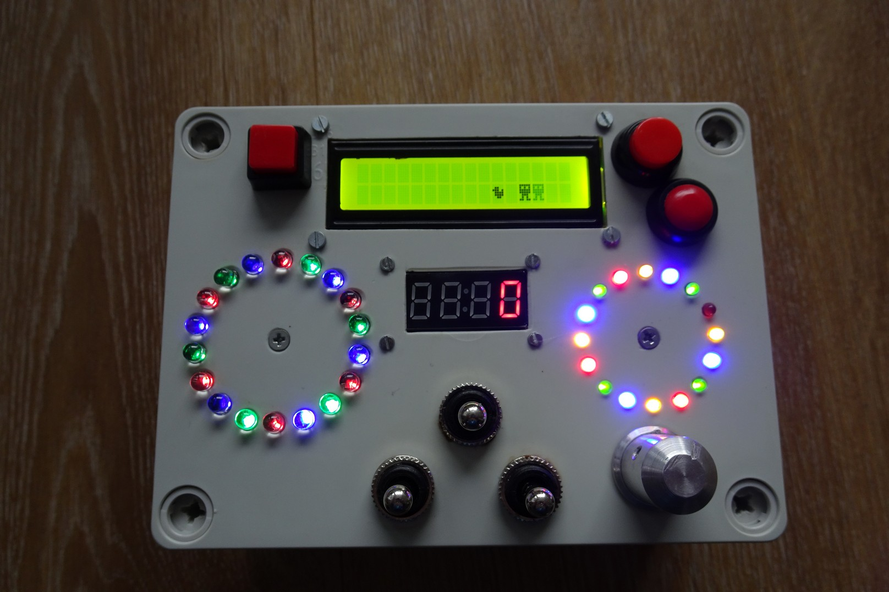
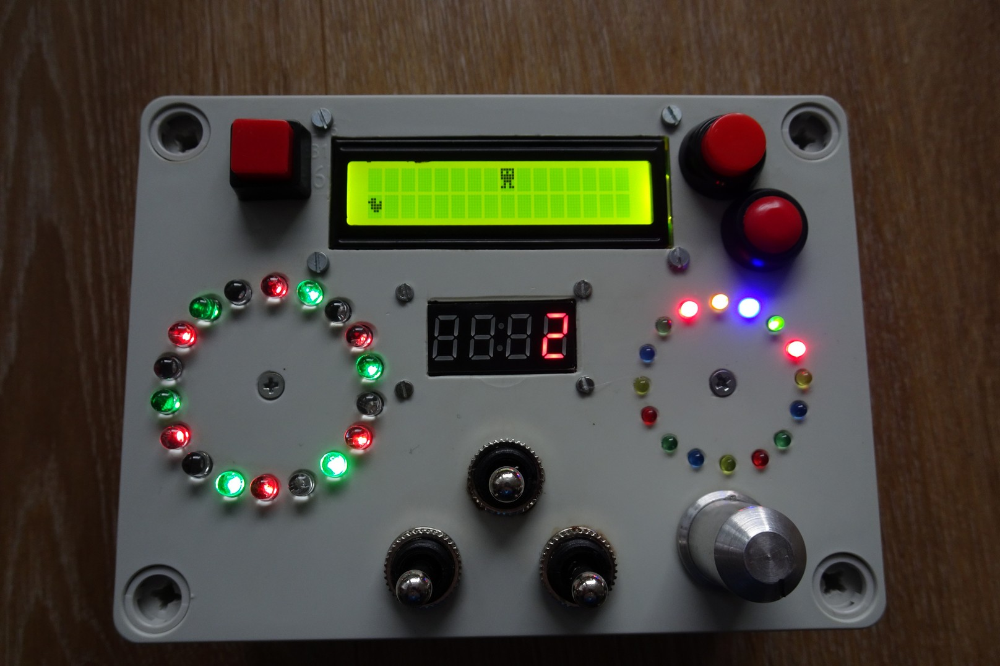

# Duck Hunter

Low cost electronics game project for children using AVR bare metal programming in C++.

## Build Instructions

### Build for Arduino Nano (ATmega328P)
```shell
make build
```

### Flash
```shell
make flash COMPORT=COM8
```

### Clean build
```shell
make clean
```

## Features

+ HD44780 16x2 LCD Modul Display an alien hunting a duck
+ TM1637 4 Digit 7-Segment Display to display the game score
+ Lots of blinking LEDs
+ Potentiometer to control move direction of the hunting alien


## Schematics

[DuckHunter.pdf](docs/DuckHunter.pdf)


# Pictures




